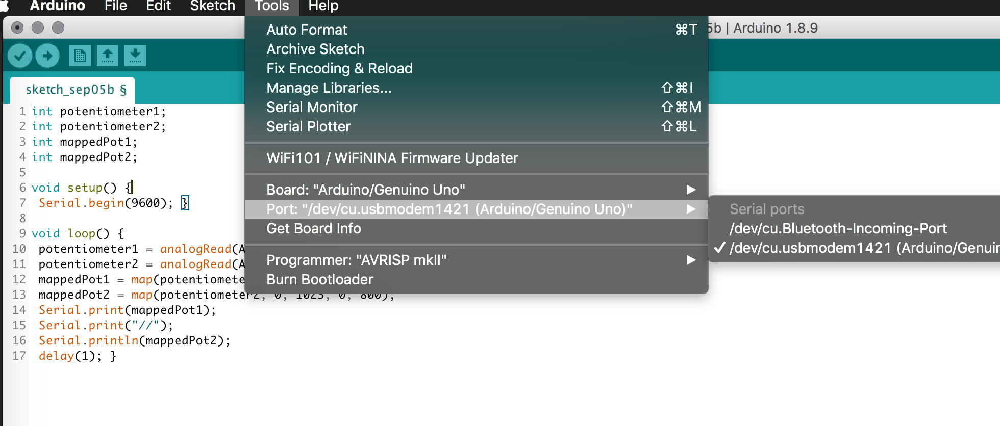
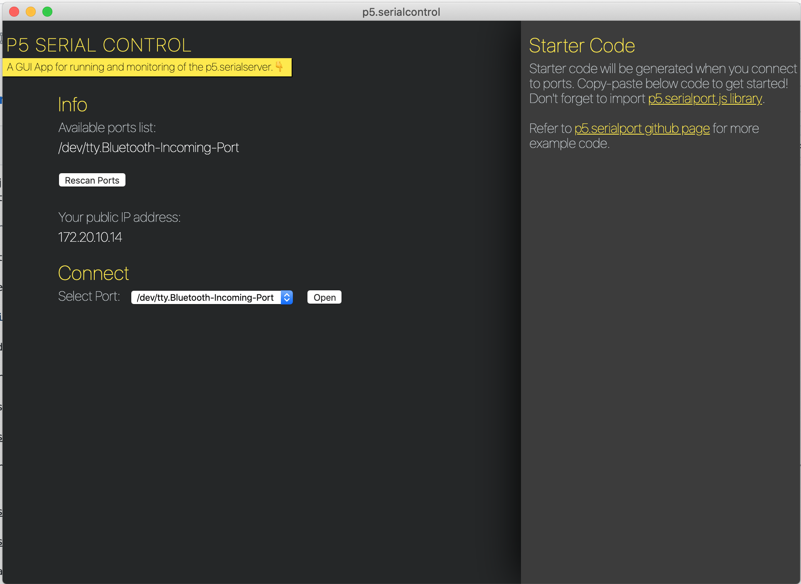

# Serielkommunikation mellem arduino og P5JS

Denne tutorial vil gøre dig i stand til at etablere serial-kommunikation mellem din p5.js sketch og din arduino gennem P5 serial control app.


## Getting started

For at lave en forbindelse mellem din arduino og p5js skal du bruge 3 ting: arduinokode, p5js kode og P5 serial control appen. Trinnene nedenfor sætter denne server op og kører eksempelkode på arduino og p5js, så du kan styre en p5js sketch med to potentiometre fra din arduino.

0.5. Download den øverste version af P5 serial control på dette link: https://github.com/p5-serial/p5.serialcontrol/releases 

1. Download eller clone dette repository så du har filerne lokalt på din computer

   https://github.com/DDlabAU/serielkommunikation-arduino-p5

2. Tilslut din arduino, åben arduino IDE'et  og noter hvilken port den er tilsluttet til på din computer

   

3. Åbn så p5js koden der ligger her: ```P5JS-serielkommunikation-med-P5serialcontrol/P5JS/sketch.js```
På linje 7 står der

   ```var portName = '/dev/cu.usbmodem1411';```

   her indsætter du dit eget portname som du noterede før. Gem så filen.

4. Byg nu kredsløbet til arduinoen i følge tegningen:

   

5. Åbn så arduinokoden du finder her: ```/P5JS-serielkommunikation-med-P5serialcontrol/Arduino/Arduino.ino ``` og upload det til arduinoen

6. Åbn P5 serial control appen

7. Vælg den samme port som før i drop down menuen

  

8. Tryk på "open" for at åbne porten

9. Lad P5 seriel control appen forblive åbent så længe du skal bruge serveren. 

10. Kør så din p5js sketch og interager med dine potentiometre for at styre p5js sketchen.   
Du kan f.eks. åbne den med ```atom-live-server```-pakken, hvis du bruger Atom.   
Hvis du vil se selve værdierne som sketchen modtager, kan du åbne konsollen i din browser, hvor de bliver vist.
